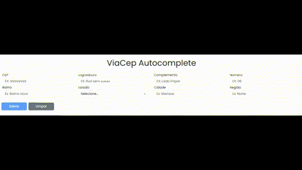

# ViaCep Autocomplete

📌 Sobre o Projeto
- ViaCep Autocomplete é uma aplicação Angular que preenche automaticamente formulários de endereço ao inserir um CEP válido. Integrado à API ViaCEP, o sistema busca e completa os campos de logradouro, bairro, cidade, estado e região, tornando o cadastro mais rápido e preciso.
---

## 🚀 Funcionalidades

- 🔹 **Autopreenchimento inteligente** ao inserir um CEP válido.
    
- 🔹 **Validação de CEP** para garantir dados corretos.
    
- 🔹 **Consumo de API ViaCEP** para obter informações atualizadas.
    
- 🔹 **Formulário reativo** utilizando Angular Reactive Forms.
    
- 🔹 **Interface intuitiva e responsiva**.
    

---

## 🛠 Tecnologias Utilizadas

- **Angular 19**
    
- **TypeScript**
    
- **Reactive Forms**
    
- **Bootstrap / SCSS**
    
- **API ViaCEP** (https://viacep.com.br/)
    

---

## 📖 Como Executar o Projeto

### 1️⃣ Clone o Repositório

```
git clone https://github.com/seu-usuario/via-cep-autocomplete.git
cd via-cep-autocomplete
```

### 2️⃣ Instale as Dependências

```
npm install
```

### 3️⃣ Execute a Aplicação

```
ng serve
```

Acesse no navegador: `http://localhost:4200/`

---

## 🎯 Como Funciona


1. Digite um **CEP válido** no campo correspondente.
    
2. O sistema consulta automaticamente a **API ViaCEP**.
    
3. Os campos de endereço são **preenchidos automaticamente**.
    
4. Revise os dados e conclua o cadastro.
